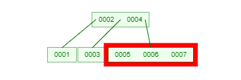
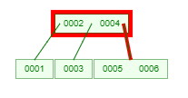

#### projet L3S6 sur les arbres B réalisé par ROUABAH Walid & Mohamed-Amine Fathallah

### Ce qui a été réalisé:
1) L'insertion d'une ou plusieurs clés
2) La recherche d'une clé
3) La documentation, avec sphinx.

### Ce qui n'a pas été réalisé ou réalisé partiellement:
-La suppression d'une ou plusieurs clés.  
-La fonction qui permet de savoir si l'arbre est un arbre b. Cette fonction aurait pu être utile dans le cas de notre projet, mais nous avons préféré vérifier graphiquement si l'arbre était un arbre b ou non.


## Sommaire :  
I) Fonctionnement du code et de la documentation
1) Comment créer un arbre
2) Comment ajouter une valeur
3) Comment chercher une valeur
4) Fonctionnement de la documentation
5) Ressources utilisées pour la réalisation de ce projet

II) Explication appronfondie du code et exemples sur la recherche et l'insertion
1) Pour la recherche
2) Pour l'insertion

## I) Fonctionnement général du code
Il est expliqué ici comment créer un arbre, puis lui insérer des valeurs et comment rechercher les valeurs.

1) ###  Comment créer un arbre :
Pour créer un arbre, il suffit de créer un objet de la classe Tree qui possède 2 paramètres obligatoires : 
- le nombre de fils minimal + 1 (L)
- le nombre de fils maximal + 1 (U)

Par exemple, pour créer un arbre avec un fils minimal et 2 fils maximal on fera alors:  
`tree = Tree(2,3)`

2) ###  Comment ajouter une valeur :
On suppose ici qu'on a arbre nommé _tree_ qui existe déjà pour les exemples.
- Pour ajouter un seul élément à un arbre, il suffit de faire :  `tree.insert(key)`  
où key correspond à un nombre entier quelconque.


- Pour ajouter plusieurs valeurs à la fois, il suffit de faire :`tree.insert(l)`  
où l correspond à une liste quelconque contenant 0 ou plusieurs entiers.

3) ###  Pour chercher une valeur :
C'est tout simple, il suffit de taper : `tree.exists_key(key)`  
où key correspond correspond à la clé qu'on veut chercher dans l'arbre.

4) ### Fonctionnement et génération de la documentation 
La documentation sous format HTML a été générée grâce à Sphinx. 
Les fichiers html de la documentation sont contenus dans docs/_build/html.

**[OPTIONNEL]**  
Je me permets de donner les commandes même si la documentation a déjà été générée :  
1) _mkdir docs_ -> à la racine du projet, j'ai crée un dossier docs qui gère toute la documentation du projet.  
2) _cd docs_  -> car maintenant pour gérer la documentation tout se fait la dedans
3) _sphinx-quickstart_ -> pour initialiser sphinx dans le dossier docs
4) Quelques modifications au niveau du fichier docs/conf.py où j'ai décommenté la ligne 13 à 15,
et où j'ai ajouté une extension à la ligne 31 pour faire fonctionner la génération de l'HTML.
5) ajouté à la ligne 13 le mot *modules* du fichier docs/index.rst pour que tous les fichiers pythons du projet soient comptabilisés dans la doc HTML.
6) sphinx-apidoc.exe -o . .. -> pour générer la doc dans l'API sphinx (sans le ".exe" si le SE n'est pas Windows)
7) _make html_ pour générer le fichier html ou bien pour le mettre a jour dans docs/_build/html 


5) ### Ressources utilisées pour la réalisation de ce projet
Nous avons utilisé plusieurs ressources pour nous aider de ce projet.  
Nous avons utilisé par exemple [programiz](https://www.programiz.com/dsa/b-tree), [btechsmartclass](http://www.btechsmartclass.com/data_structures/b-trees.html) et [Wikipedia](https://fr.wikipedia.org/wiki/Wikip%C3%A9dia:Accueil_principal).  
Il est bon à savoir que nous n'avons bien évidemment pas plagié ou copié le code issu de ces sites, bien que nous nous sommes inspirés, par exemple pour la recherche (surtout par la recherche dichotomique, car elle y ressemble pas mal).  
Nous avons également beaucoup utilisé le site https://www.cs.usfca.edu/~galles/visualization/BTree.html , éventuellement pour illustrer les arbres dans la partie 2 du rapport.    


## II) Explication du code et exemples sur la recherche et l'insertion
On parlera ici de manière détaillée de toutes les situations différentes auquels on peut tomber quand on recherche une clé ou quand on ajoute une clé dans l'arbre,
en citant et en expliquant le code, avec des illustrations issues du site https://www.cs.usfca.edu/~galles/visualization/BTree.html.

1) ###  La fonction de recherche
Nous allons ici expliquer de manière détaillée le fonctionnement de la fonction de recherche exists_key() de la classe Node.  
D'abord, il est bon à savoir que la fonction search_keys() de la classe Tree appelle juste la fonction de la classe Node en utilisant le noeud racine de l'arbre en paramètre.  

Supposons donc qu'on a un arbre `tree = Tree(2,3)` dans lequel est déjà inséré des valeurs et qu'on cherche la valeur 34.  
Au tout début de l'itération nous sommes au noeud racine de l'arbre, correspondant à la valeur 16.  

Une remarque à ajouter avant de commencer : peu importe le nombre de fils minimum et maximum, le résultat de cet exemple reviendrait au même.
#### Etape 1
<table>
<tr>
<td>
  
</td>
<td>

``` Python
        i = 0
        # pour la première itération, i < 1 et 34 > 16 donc i += 1
        # il n'y aura pas de deuxieme itération car i sera égal à la taille des clés du noeud. (donc 1)
        while i < len(self.keys) and searching_key > self.keys[i]:
            i += 1
            
        #donc i = 1
        
        # le noeud n'est pas un leaf donc on passe ce bloc
        if self.leaf: 
            return i < len(self.keys) and searching_key == self.keys[i]
            
        # on applique donc la condition ci dessous
        else:
            # i == self.keys == 1 donc on applique ce code
            if i == len(self.keys):
                # vu que 34 est supérieur à 16 on va à la partie de droite et on 
                # applique la fonction de maniere recursive au noeud enfant
                # on peut maintenant passer à l'etape 2.
                self.childrens[-1].exists_key(searching_key)

            # cette partie est donc ignorée
            elif self.keys[i] == searching_key:
                return True
            # de même pour cette partie
            return self.childrens[i].exists_key(searching_key)
}
````

</td>
</tr>
</table>

#### Etape 2
<table>
<tr>
<td>
  
</td>
<td>

``` Python
        i = 0
        # cette fois ci i restera a 0 car 34 < 50.
        while i < len(self.keys) and searching_key > self.keys[i]:
            i += 1
            
        # donc i = 0
        
        # le noeud n'est pas un leaf donc on passe ce bloc
        if self.leaf: 
            return i < len(self.keys) and searching_key == self.keys[i]
            
        # on applique donc l'autre condition ci dessous
        else:
            # i = 0 et la taille des clés égale à 1 donc on ignore ce bloc
            if i == len(self.keys):
                self.childrens[-1].exists_key(searching_key)

            # self.keys[i] (==50) n'est pas égal à searching_key (== 34) donc on ignore
            elif self.keys[i] == searching_key:
                return True
            # on applique donc de manière recursive le code,
            # cette fois ci a la partie gauche car clé recherchée inférieure de 50
            return self.childrens[i].exists_key(searching_key)
}
````

</td>
</tr>
</table>

#### Etape 3
<table>
<tr>
<td>
  
</td>
<td>

``` Python
        i = 0
        # cette fois ci i restera a 0 car 34 == 34.
        while i < len(self.keys) and searching_key > self.keys[i]:
            i += 1
            
        # donc i = 0
        
        # le noeud est un leaf donc on applique ce bloc :
        if self.leaf: 
            # on retourne cette condition, et self.keys[i] (== 34) est bien égale à la clé qu'on recherche
            # donc la clé a été retrouvée : on retourne True.
            return i < len(self.keys) and searching_key == self.keys[i]
            
        else:
            if i == len(self.keys):
                self.childrens[-1].exists_key(searching_key)

            elif self.keys[i] == searching_key:
                return True
            return self.childrens[i].exists_key(searching_key)
}
````

</td>
</tr>
</table>

Bien que selon le nombre qu'on cherche l'ordre des blocs peut être différent, nous avons appliqué dans cet exemple l'usage de tous les blocs dans toutes les situations.  
Il est bon à savoir que la fonction est de compléxité O(log n), comme demandé dans les consignes du projet.


2) ###  L'insertion
Pour l'insertion, 4 méthodes ont été réalisées et utilisées. Nous allons commencer par expliquer la méthode split() de la classe Tree.  

La classe split() permet de traiter le noeud qui a un nombre de clés supérieur à son nombre de fils maximal. Ou plus exactement traiter un noeud contenant n clés où n correspond au nombre de fils maximal + 1.  

Dans la classe split() est traité exactement 2 situations différentes :  
-celui où le noeud est une racine : il faudra donc créer 2 nouveaux noeuds enfants et leur attribuer la partie gauche du noeud (clés + enfants), et la partie droite du noeud (clés + enfants) sans oublier certains détails dont on va expliquer après avec une illustration.  
-celui où le noeud ne l'est pas : il faudra donc créer un seul noeud qui prendra la partie droite du noeud en paramètre, ainsi que ses enfants de la partie droite sans oublier certains détails dont on va expliquer après avec une illustration.  

On va commencer par illustrer & expliquer en détails la partie où un noeud racine est concerné par ce problème de clés supérieur au nombre d'enfant.

#### tree.split() : cas où le noeud à traiter est une racine.
En supposant qu'on ait ajouté une valeur (la valeur 15) dans un arbre `tree = Tree(2,3)` : on est censé avoir 2 clés maximales, or on en a 3 dans le tableau de clé de la racine. On va donc traiter le problème avec split().  
Voir premier schéma pour voir la structure de l'arbre après insertion sans le split()
<table>
<tr>
<td>
  
  

</td>
<td>

``` Python
        # la taille est de 3
        length = len(node.keys)
        
        # la valeur à récupérer est nécessaire car c'est celle ci qui va monter vers son parent, pour split ensuite le noeud.
        # si c'est une racine, alors on va faire en sorte que le noeud ne conserve que la valeur du milieu,
        # en ajoutant 2 nouveaux noeuds fils, qui récupéreront la partie gauche et la partie droite. (clés + noeuds enfants)
        
        # dans le cas d'un nombre pair, on aimerait récupérer la valeur du milieu -1
        if length % 2 == 0: 
            valueToMove = node.keys[length // 2 - 1]
        else:
         # dans le cas d'un nombre impair, on peut directement récupérer celui du milieu
            valueToMove = node.keys[length // 2] # valueToMove = 5
        node.keys.remove(valueToMove) #node.keys = [3,15]
        
        # la taille passe à 2, car on a retiré du noeud la valeur. elle reste stockée dans la variable qu'on utilisera à la fin.
        length = len(node.keys)
        
        
        if node.parent is not None:
        ...
        # je me permets d'effacer cette partie car elle est très longue, et inutile dans notre exemple
        
        # rappel : nous sommes dans la situation où le noeud à split est une racine. Donc tout sera traité dans le bloc du bas :
        else:
        
        #on crée les deux noeuds enfants qui auront la propriété du noeud en paramètre. Si ce n'est pas un leaf alors leaf sera false et inversement.
        # vu que ce sont les enfants on a au premier parametre : le noeud en paramètre.
            nLeft = Node(node, node.leaf)
            nRight = Node(node, node.leaf)
            
            # donc si le noeud en paramètre était un leaf, vu que les enfants sont crées alors on peut le mettre à false.
            if node.leaf:
                node.leaf = False # dans notre cas, node.leaf passe à False

            # on attribue la moitié gauche des clés du noeud au noeud enfant gauche,
            # et pareil pour la droite où cette fois ci seront attribués la partie droite des clés du noeud.
            nLeft.keys = node.keys[:length // 2]    # = [3]
            nRight.keys = node.keys[length // 2:]   # = [15]
            
            # il faut faire de même pour les enfants
            # le noeud racine n'a pas d'enfant donc les fils restent vides.
            nLeft.childrens = node.childrens[:len(node.childrens) // 2]
            nRight.childrens = node.childrens[len(node.childrens) // 2:]
            
            # et donc ne pas oublier d'attribuer aux enfants leur nouveau parent
            # pour la partie gauche
            for child in node.childrens[:len(node.childrens) // 2]:
                child.parent = nLeft

            # et pour la partie droite
            for child in node.childrens[len(node.childrens) // 2:]:
                child.parent = nRight


            # on oublie pas d'ajouter au noeud les 2 nouveaux enfants en tant qu'enfant
            node.childrens = [nLeft, nRight]
            
            # et on supprime toutes les clés pour ensuite ajouter la clé du milieu qui sera la seule à rester.
            node.keys.clear()             # node.keys = []
            node.keys.append(valueToMove) # node.keys = [5]
}
````
</td>
</tr>
</table>

#### tree.split() : cas où le noeud à traiter n'est pas une racine.
En supposant qu'on ait ajouté une valeur (la valeur 7) dans un arbre `tree = Tree(2,3)` : on est censé avoir 2 clés maximales, or on en a 3 dans le tableau de clé de la racine. On va donc traiter le problème avec split().  
Voir premier schéma pour voir la structure de l'arbre après insertion sans le split()
<table>
<tr>
<td>
1)   
2)   
  

</td>
<td>

``` Python
        # la taille est de 3
        length = len(node.keys)
        
        # la valeur à récupérer est nécessaire car c'est celle ci qui va monter vers son parent, pour split ensuite le noeud.
        # si c'est une racine, alors on va faire en sorte que le noeud ne conserve que la valeur du milieu,
        # en ajoutant 2 nouveaux noeuds fils, qui récupéreront la partie gauche et la partie droite. (clés + noeuds enfants)
        
        # dans le cas d'un nombre pair, on aimerait récupérer la valeur du milieu -1
        if length % 2 == 0: 
            valueToMove = node.keys[length // 2 - 1]
        else:
         # dans le cas d'un nombre impair, on peut directement récupérer celui du milieu
            valueToMove = node.keys[length // 2] # valueToMove = 5
        node.keys.remove(valueToMove) #node.keys = [3,15]
        
        # la taille passe à 2, car on a retiré du noeud la valeur. elle reste stockée dans la variable qu'on utilisera à la fin.
        length = len(node.keys)
        
        if node.parent is not None:
            # on va premièrement créer un nouveau noeud qui aura les memes propriétés que le noeud
            newNode = Node(node.parent, node.leaf) 
            newNode.keys = node.keys[length // 2:] # on attribue les clés de la partie droite du noeud au nouveau noeud
            # newNode.keys est donc égal à [7]
            
            node.keys = node.keys[:length // 2] # et on enleve les clés de la partie droite du noeud : on laisse donc seulement la partie gauche
            node.keys est donc égal à [5]
            
            # il faudra donc laisser les enfants de la partie gauche à la partie gauche, 
            # et ajouter les enfants de la partie droite au nouveau noeud droit
            newNode.childrens = node.childrens[len(node.childrens) // 2:]
            # newNode.childrens est donc égal à [] car pas d'enfant
            
            # ne pas oublier d'attribuer aux nouveaux enfants de la partie droite leur parent
            # ici dans ce cas précis il n'y a aucun enfant donc la boucle n'a pas d'itération
            for child in newNode.childrens:
                child.parent = newNode
            
            # et ceux de la partie droite à la partie droite

            node.childrens = node.childrens[:len(node.childrens) // 2]
            # il n'y a pas d'enfant donc node.childrens = []

            # on insère la clé avec un ordre numérique au noeud parent du noeud en paramètre
            i = node.parent.keyIndex(valueToMove) # i = 2
            node.parent.keys.insert(i, valueToMove)
            # donc node.parent.keys = [4,5,6]

            i = 0
            # on insere l'enfant a l'endroit qui lui est attribué : 
            # donc on vérifie les valeurs de l'enfant pour ne pas l'insérer au mauvais endroit
            for child in node.parent.childrens:
                if child.keys[-1] < newNode.keys[-1]:
                    i += 1
            node.parent.childrens.insert(i, newNode)
            # et le noeud contenant 7 est à la dernière position dans ce cas précis
            # car c'est l'enfant avec la plus grande valeur

            # et si après l'ajout, le noeud parent doit être traité alors on applique la méthode de manière récursive
            # dans notre cas, vu que 6 est passé dans le noeud du haut alors on devra appliquer à la racine comme à l'etape 1 un traitement.
            if len(node.parent.keys) > self.nbChildMax:
                self.split(node.parent)
        else:
        # situation où le noeud est une racine
        ...
}
````
</td>
</tr>
</table>

Maintenant passons à l'explication de l'insertion dans la classe Node. Il faut savoir que la méthode d'insertion de sert vraiment qu'à insérer la clé dans le noeud correspondant et rien d'autre.  
Cela voudra donc dire qu'après insertion, split() devra s'occuper de traiter le noeud correspondant, si nécéssaire.

<table>
<tr>
<td>
  

</td>
<td>

``` Python
        i = self.keyIndex(key) # on doit connaitre l'index pour placer la clé au bon endroit
        # ici i est égal à 2 car 7 est plus grand que 2 et 4
        
        if not self.leaf: # si ce n'est pas une feuille alors cela voudra dire qu'elle doit etre insérée dans une feuille
        
            bool = self.childrens[i].insert(key, tree) # donc on l'insère au fils[i]
            # car en effet dans cette situation on doit aller au 3eme fils donc d'index 2 pour ajouter la valeur
            
            if bool: # si la condition est vraie alors
                tree.split(self.childrens[i]) # on applique le split expliqué ci-dessus
                return len(self.keys) > tree.nbChildMax 
            else:
                return False
        else: 
            self.keys.insert(i, key)
            return len(self.keys) > tree.nbChildMax
}
````

Le booléen retourné permettra à la méthode insert() de Tree de pouvoir split si nécessaire, entre autres.

</td>
</tr>
</table>

<table>
<tr>
<td>
  
  

</td>
<td>
nous sommes à partir d'ici dans le insert() récursif de la ligne 397 du rapport

``` Python
        i = self.keyIndex(key) # on doit connaitre l'index pour placer la clé au bon endroit
        # ici i est égal à 2 car 7 est plus grand que 5 et 6
        
        if not self.leaf: 
        
            bool = self.childrens[i].insert(key, tree) 
            
            if bool: 
                tree.split(self.childrens[i]) 
                return len(self.keys) > tree.nbChildMax 
            else:
                return False
        else: # dans notre cas le noeud est un leaf donc on ajoute la clé dans l'index i
            self.keys.insert(i, key) # ajout de la clé à l'index
            return len(self.keys) > tree.nbChildMax
}
````

</td>
</tr>
</table>

